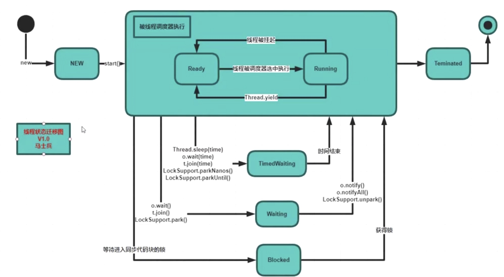

#### 多线程学习

##### Thread 创建几种方式

1.集成Thread 类重写Run()方法

2.实现Runnable接口方法的run方法

3.通过线程池来添加

4.[创建线程代码](../../java/com/study/jdk/studysychironized/threed/CreateThread.java)

##### Thread类常见的方法

1.join方法

2.sleep方法

3.wait方法

[Thread常见方法代码](../../java/com/study/jdk/studysychironized/threed/StudyThreed.java)

##### Thread状态

#### 产考文档

[2020年Java多线程与并发系列](https://juejin.im/post/5e8ee367518825736d279551)
